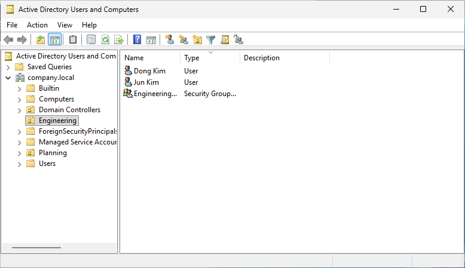
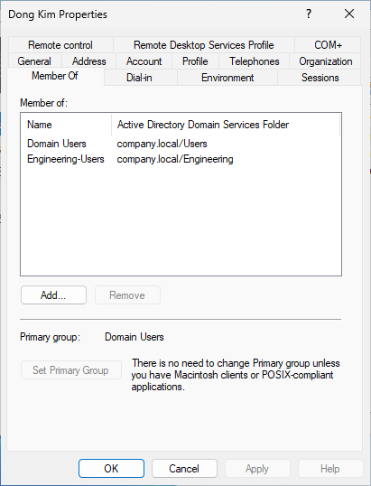
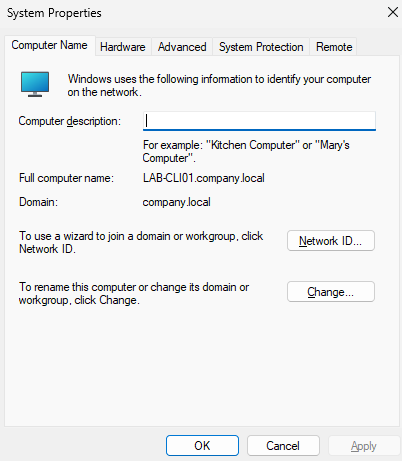
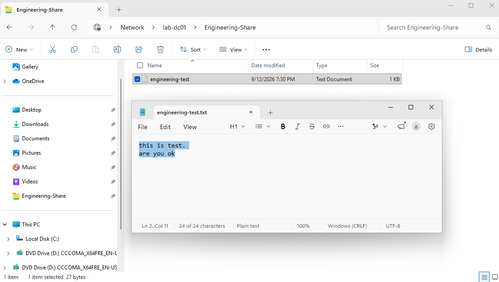
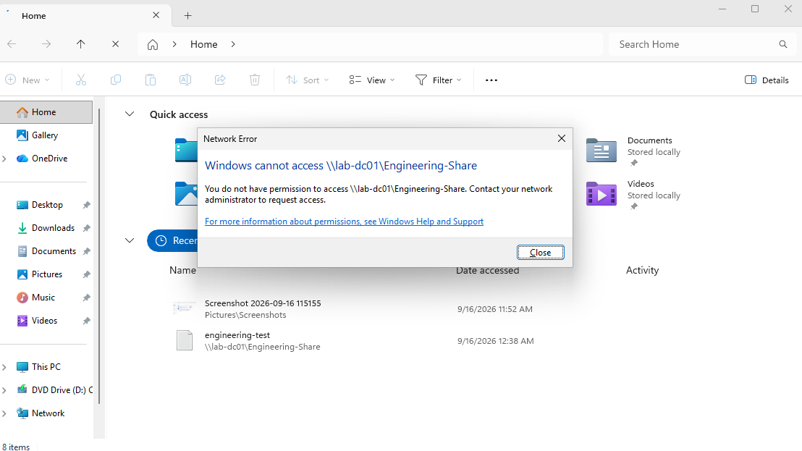

# Windows Server Active Directory Home Lab

Hands-on Windows Server Active Directory lab built to practice core enterprise IT administration, identity management, domain services, and group-based access control.

## Lab Overview

This lab simulates a small Windows domain environment using Windows Server 2025 and a Windows client.

The environment was configured to practice:

- Active Directory Domain Services (AD DS)
- DNS and domain configuration
- Organizational Units (OUs)
- User and security group administration
- Windows client domain join
- Group-based file share permissions
- Authorized and unauthorized access testing

## Lab Environment

- **Domain Controller:** LAB-DC01
- **Domain:** company.local
- **Client:** LAB-CLI01
- **Server OS:** Windows Server 2025
- **Directory Service:** Active Directory Domain Services
- **File Share:** Engineering-Share

## 1. Active Directory OU and User Configuration

Created an **Engineering OU**, domain users, and an Engineering security group in Active Directory Users and Computers.

## 2. Security Group Membership

Assigned the Engineering user to the appropriate security group to implement group-based access control.

## 3. Windows Client Domain Join

Joined the Windows client **LAB-CLI01** to the **company.local** Active Directory domain.

## 4. Authorized File Share Access

Configured and tested the **Engineering-Share** network folder. An authorized Engineering user was able to access the share and create a test file.

## 5. Unauthorized Access Validation

Tested access using a user without the required Engineering permissions. Access to the same network share was successfully denied.

## What I Practiced

This lab provided hands-on experience with:

- Windows Server administration
- Active Directory user and group management
- Organizational Unit design
- Domain-joined Windows clients
- Security group membership
- SMB file sharing
- Group-based access control
- Permission validation and troubleshooting

## Key Takeaway

The lab demonstrates not only the configuration of Active Directory objects, but also validation of the resulting access-control behavior.

Authorized Engineering users were granted access to the departmental share, while unauthorized users were denied access as intended.
